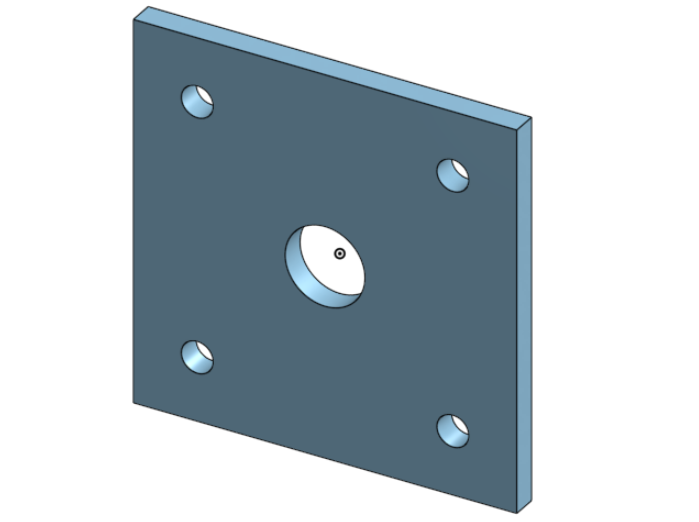
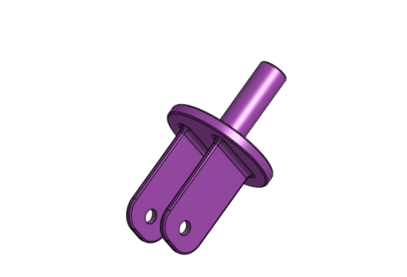

# Basic_Onshape_CAD
We are creating a caster.

---
## Table of Contents
* [Table of Contents](#Table-of-Contents)
* [Base](#Base)
* [Mount](#Mount)
* [Fork](#Fork)
* [Tire](#Tire)
* [Wheel](#Wheel)
* [AxleCollarBearings](#AxleCollarBearings)

## Base

### Description

The first assignment is to create the caster base.  The base's dimensions are 200 mm x 120 mm and 8 mm thick.  It has 6 holes 10 mm wide and 20 mm from the edge equally spaced along the edges.

### Evidence
[The Base in Onshape](https://cvilleschools.onshape.com/documents/0d70f655203ca304cb3c5b7d/w/f55603f962f6fc74f5548a68/e/41d730c570a8d75fce9f51b6)

### Image

### Reflection

This was my first Onshape part and [following along with Dr. Shields made it super easy.](https://www.youtube.com/watch?v=93BFUD-HAG8&feature=emb_title&scrlybrkr=5670f0b4)  I learned about 
* sketching (shortcut **shift-s**)
* constructions lines (shortcut **Q**)
* dimensions (shortcut **D**)
* extruding both add and remove (shortcut key **E**)
* linear patterns (no shortcut)

Onshape is awesome.  I found it really helpful to rename all my sketches.  It is going to be a GREAT year in engineering.

---

## Mount

### Description
This assignment was to create a mount. The mounts dimensions are 120x120mm.It also has a big circle in the middle that is 2mm and there are 4 circles 10 in diameterx 20 from each side
### Evidence
[my onshape mount](https://cad.onshape.com/documents/dba4cd6e5ea83b6b0ec5104c/w/5ba62e2972ce409275a7e32d/e/c1015ed57171b2af8d30da36)
### Image

### Reflection 
I learned more shortcuts
---

## Fork

### Description
The next assignment was to create a fork. The circle part was 80mm in diameter. There were two arms with 15mm fillets. There's a 10mm hole in both arms. Then a base was added that was 15x20 mm.
### Evidence
[My onshape fork](https://cad.onshape.com/documents/751d72c513828806f933883e/w/ee5666385dd77c88016a3b2f/e/753386aab24835b4dabf5350)
### Image

### Reflection
I learned about the mirror tool. It was cool how you could just duplicate the same part on the other side.

---

## Tire

### Description
This assignment was to create a tire. The dimensions of this tire was 20x80 and 20x110 and it was 10 away from the origin.
### Evidence
[My onshape tire](https://cad.onshape.com/documents/0e82917ac965ed0d68ab9d06/w/4e2aa4134adcf4b6522a6531/e/25ebcd94540d37aa032a7b9d)
### Image
<img src="Images/Tire.png" width="200"
### Reflection
I learned how to draw out the dimensions for the tire.
---

## Wheel

### Description

### Evidence

### Image

### Reflection

---

## AxleCollarBearings

### Description

### Evidence

### Image

### Reflection

---
